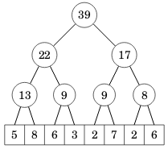
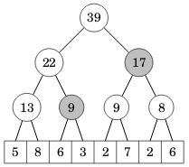
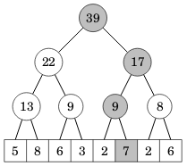

# 4. Range queries

In this chapter, we consider the task of efficiently processing range queries in a list of numbers. Common range queries include calculating the sum of numbers in a given range, and finding the minimum or maximum value in a given range. We use a simple and efficient data structure called a segment tree to process such queries.

## Range sum queries

Let's start with range sum queries. We have a list of numbers, and we need to calculate the sum of numbers in a given range. Let $$\textrm{sum}(a,b)$$ denote the sum of numbers in a range from position $$a$$ to position $$b$$.

For example, consider the list $$[5,8,6,3,2,7,2,6]$$, where the positions are indexed from $$0$$ to $$7$$. Some range queries on this list are:

- <span></span>$$\textrm{sum}(0,1)=5+8=13$$
- <span></span>$$\textrm{sum}(2,4)=6+3+2=11$$
- <span></span>$$\textrm{sum}(5,5)=7$$
- <span></span>$$\textrm{sum}(0,7)=5+8+6+3+2+7+2+6=39$$

It is easy to process range sum queries in $$O(n)$$ time, because we can just go through the range using a loop and add up the numbers. However, this may be too slow if there are many queries.

We can process range sum queries in $$O(1)$$ time if we first create another list that contains all cumulative sums for the original list. A cumulative sum is the sum of all list values up to a given position. For example, the cumulative sums for the list above are $$[5,13,19,22,24,31,33,39]$$.

Using the cumulative sums, we can easily answer any query of the form $$\textrm{sum}(0,k)$$, because we have already calculated answers to all such queries. To process a query of the general form $$\textrm{sum}(a,b)$$, we can use the formula

$$\textrm{sum}(a,b)=\textrm{sum}(0,b)-\textrm{sum}(0,a-1).$$

For example, in the list above,

$$\textrm{sum}(2,4)=\textrm{sum}(0,4)-\textrm{sum}(0,1)=24-13=11.$$

The above approach works well if the original list is never modified, but updating the elements becomes difficult. For example, if we change the first element in the list, this affects all cumulative sums. Thus, updating an element now takes $$O(n)$$ time which may be too slow.

Using the above techniques, we can process either updates or queries efficiently, but not both of them at the same time. Fortunately, there are more advanced data structures that allow us to process _both_ updates and queries efficiently. Next, we will learn about a data structure called a segment tree that achieves this.

## Segment trees

A segment tree is a tree data structure that stores the elements of a list and some extra values to help process updates and queries efficiently. Here is a sum segment tree for the list $$[5,8,6,3,2,7,2,6]$$:



We assume that the length of the list is a power of two. If it is not, we can add extra elements to the end of the list.

Each segment tree node stores the sum of elements in a range. The top node represents the entire list. The left child of each node represents the left half of the range, and the right child represents the right half. The leaves of the tree are the original list elements.

For example, in the segment tree above, the node with value $$22$$ represents the sublist $$[5,8,6,3]$$ with sum $$5+8+6+3=22$$. The left child of the node with value
$$13$$ represents the sublist $$[5,8]$$ with sum $$5+8=13$$, and the right child with value $$9$$ represents the sublist $$[6,3]$$ with sum $$6+3=9$$.

We can calculate any range sum as a sum of $$O(\log n)$$ values from segment tree nodes. For example, consider the sublist $$[6,3,2,7,2,6]$$ with sum $$6+3+2+7+2+6=26$$. We can calculate this sum using two segment tree nodes:



The node with sum $$9$$ represents the sublist $$[6,3]$$, and the node with sum $$17$$ represents the sublist $$[2,7,2,6]$$. The total sum is $$9+17=26$$.

When an element is updated, we update all segment tree nodes that contain that element. There are $$O(\log n)$$ such nodes. For example, when we update the list value $$7$$, the following nodes will be affected:



A segment tree for a list of $$n$$ values has $$2n-1$$ nodes. A convenient way to store these nodes is by using a list that contains the node values from top to bottom and left to right. For example, the representation for the segment tree above is:

position | 0 | 1 | 2 | 3 | 4 | 5 | 6 | 7 | 8 | 9 | 10 | 11 | 12 | 13 | 14 | 15
value | -- | 39 | 22 | 17 | 13 | 9 | 9 | 8 | 5 | 8 | 6 | 3 | 2 | 7 | 2 | 6

Note that position $$0$$ is not used, and position $$1$$ represents the top node. The children of a node at position $$k$$ are at positions $$2k$$ and $$2k+1$$, and the parent is at position $$\lfloor k/2 \rfloor$$. This representation is similar to the standard way of storing a binary heap.

The following code shows how to implement segment tree operations:

```cpp
class SegmentTree {
public:
    int n;
    std::vector<int> tree;

    SegmentTree(int size) {
        n = 1;
        while (n < size) n *= 2;
        tree.assign(2 * n, 0);
    }

    void inc_val(int pos, int add) {
        pos += n;
        tree[pos] += add;
        for (pos /= 2; pos >= 1; pos /= 2) {
            tree[pos] = tree[2 * pos] + tree[2 * pos + 1];
        }
    }

    int get_sum(int left, int right) {
        left += n; right += n;
        int sum = 0;
        while (left <= right) {
            if (left % 2 == 1) sum += tree[left++];
            if (right % 2 == 0) sum += tree[right--];
            left /= 2; right /= 2;
        }
        return sum;
    }
};
```

The constructor takes the size of the list and finds the smallest $$n$$ that is a power of two. Initially each list element is $$0$$. The `inc_val` function increases the value at position `pos` by `add` and updates the parent nodes in the tree. The `get_sum` function calculates the sum for the range from position `left` to position `right` by moving from bottom to top of the tree. Both the functions work in $$O(\log n)$$ time.

The following code example creates a segment for the list $$[5,8,6,3,2,7,2,6]$$ and performs some range sum queries.

```cpp
SegmentTree st(8);

st.inc_val(0, 5);
st.inc_val(1, 8);
st.inc_val(2, 6);
st.inc_val(3, 3);
st.inc_val(4, 2);
st.inc_val(5, 7);
st.inc_val(6, 2);
st.inc_val(7, 6);

cout << st.get_sum(0, 1) << "\n"; // 13
cout << st.get_sum(2, 4) << "\n"; // 11
cout << st.get_sum(5, 5) << "\n"; // 7
cout << st.get_sum(0, 7) << "\n"; // 39
```

## Counting inversions

As the first application of segment trees, we consider the problem of counting the number of inversions in a list of $$n$$ numbers. An inversion is a pair of list elements $$(a,b)$$ such that $$a>b$$ and $$a$$ comes before $$b$$ in the list. For example, the list $$[3,1,4,2]$$ has three inversions: $$(3,1)$$, $$(3,2)$$, and $$(4,2)$$.

We create an algorithm that goes through the list from left to right and calculates, for each position, the number of inversions whose second element is at that position. For example, for the list $$[3,1,4,2]$$, element $$1$$ appears in one inversion $$(3,1)$$ and element $$2$$ appears in two inversions $$(3,2)$$ and $$(4,2)$$.

We use a segment tree to efficiently calculate the number of inversions. For simplicity, we assume that each value in the list is an integer between $$1$$ and $$n$$. For each such value, we keep a counter in the segment tree, which is initially set to $$0$$. When we process a value $$x$$ from the list, we first count how many values between $$1$$ and $$x-1$$ have already appeared in the list using a range sum query. This gives the number of inversions where the second value is $$x$$. After that, we increase the counter at position $$x$$ by one using an update query.

The following function returns the number of inversions in `numbers`:

```cpp
long count_inversions(vector<int> &numbers) {
    int n = numbers.size();
    SegmentTree counts(n + 1);
    long total = 0;
    for (int i = 0; i < n; i++) {
        total += counts.get_sum(1, numbers[i] - 1);
        counts.inc_val(numbers[i], 1);
    }
    return total;
}
```

The function works in $$O(n \log n)$$ time because it performs one range query and one update operation for each element in the list.

Now consider a more general situation where the input list can contain any numbers, not just numbers between $$1$$ and $$n$$. We can use the same algorithm as above with one change: before running the algorithm, we relabel the list elements so that they are between $$1$$ and $$n$$, keeping their relative order the same. This is always possible because there are at most $$n$$ distinct elements. For example, for the list $$[42,1337,5,42,5]$$, the relabeled list is $$[2,3,1,2,1]$$. We can relabel the values in $$O(n \log n)$$ time, so the time complexity does not change.

Segment trees can be used as a general tool for solving many problems where there exists an alternative ad hoc textbook algorithm. A traditional way to count the number of inversions in $$O(n \log n)$$ time is to use an extended version of the merge sort algorithm. Our algorithm above can be seen as a more direct approach because it simply goes through the list and counts the number of inversions at each position.

## Range minimum queries

## Increasing subsequences
