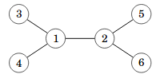
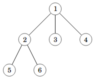
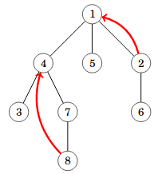
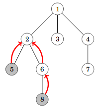

# 5. Tree algorithms

TODO

## Basics of trees

A tree is an undirected graph that is both connected and acyclic. For example, here is a tree that consists of $$6$$ nodes:



Here are some properties and terms related to trees:

* A tree of $$n$$ nodes always has $$n-1$$ edges. For example, the tree above has $$6$$ nodes and $$5$$ edges.
* If we remove any edge from a tree, the graph is no longer connected.
* If we add any edge to a tree, the graph is no longer acyclic.
* The _leaves_ of a tree are the nodes whose degree is $$1$$, meaning that they are connected to exactly one other node. For example, the leaves in the tree above are nodes $$3$$, $$4$$, $$5$$, and $$6$$.
* There is a single shortest path between any two nodes in a tree. For example, the shortest path between node $$1$$ and node $$5$$ is $$1-2-5$$.
* The _distance_ between two nodes in a tree is the number of edges in the shortest path between them. For example, the distance between nodes $$1$$ and $$5$$ is $$2$$.

Note that when we define a tree as above, the tree has no hierarchy. That is, there is no root node, and the nodes do not have children. According to the definition, any undirected graph that is both connected and acyclic is a tree.

A convenient way to store a tree in C++ is to use a vector of vectors to represent the adjacency list of the graph. For example, the following code defines the tree shown above:

```cpp
vector<vector<int>> tree(6+1);

tree[1].push_back(2);
tree[1].push_back(3);
tree[1].push_back(4);
tree[2].push_back(1);
tree[2].push_back(5);
tree[2].push_back(6);
tree[3].push_back(1);
tree[4].push_back(1);
tree[5].push_back(2);
tree[6].push_back(2);
```

## Rooting the tree

Even if we work with trees that do not have a root node, it is often useful to _root_ the tree by choosing one of the nodes as the root. After that, we can conveniently use recursion and other techniques to process the tree.

As an example, consider the problem of coloring the tree nodes so that each node is either black or white, no two adjacent nodes are black, and the number of black nodes is as large as possible. For example, the optimal coloring in the tree


is to color nodes $$1$$ and $$2$$ white and nodes $$3$$, $$4$$, $$5$$, and $$6$$ black, which gives a coloring with four black nodes. To find such a coloring, we can use a recursive algorithm that works for a rooted tree. First, choose any node and appoint it as the root of the tree. For example, let's choose node $$1$$ as the root:



Then, we can calculate, for each node $$x$$, two values:

* The maximum number of black nodes in the subtree of node $$x$$ assuming that node $$x$$ is white.
* The maximum number of black nodes in the subtree of node $$x$$ assuming that node $$x$$ is black.

The following code shows how we can calculate the maximum number of black nodes in practice. The function is given three parameters: `node` is the current node, `parent` is its parent node, and `color` is $$0$$ (white) or $$1$$ (black).

```cpp
int max_black_nodes(int node, int parent, int color) {
    int count = 0;
    for (auto child : graph[node]) {
        if (child == parent) continue;
        if (color == 0) {
            count += max(max_black_nodes(child, node, 0),
                         max_black_nodes(child, node, 1));
        }
        if (color == 1) {
            count += max_black_nodes(child, node, 0);
        }
    }
    return count;
}
```

The loop goes through all children of the current node. The parameter `parent` is used to make sure that the parent of the node is not considered as a child node. If the color of the node is white, the color of its child can be white or black. If the color of the node is black, the color of its child can only be white.

To calculate the number of black nodes in the optimal coloring, we can take the maximum of `max_black_nodes(1, 0, 0)` and `max_black_nodes(1, 0, 1)`, where $$1$$ is the appointed root node. The value $$0$$ for the parent means that the root node does not have a parent. We take the maximum of the two values because the color of the root node can be either black or white.

To speed up the algorithm, we can use dynamic programming and store the result of the function for each combination of node and color, a total of $$2n$$ combinations where $$n$$ is the number of nodes. Thus, we can find the maximum number of black nodes in a coloring in $$O(n)$$ time.

## Tree diameter

The _diameter_ of a tree is the maximum distance between any two nodes in the tree. For example, the diameter of the tree


is $$3$$ because we can choose two nodes (such as $$3$$ and $$5$$) whose distance is $$3$$, but it is not possible to choose two nodes with distance $$4$$.

To calculate the diameter of a tree, it is useful to root the tree first:


A useful observation is that the maximum distance always corresponds to a path between two leaves. We can represent such a path by combining two paths: first going upwards from a leaf to an intermediate node, then downwards to another leaf. For example, the tree above contains the following path from node $$3$$ to node $$5$$, where node $$1$$ is the intermediate node:

* Go from node $$3$$ upwards to node $$1$$ (length $$1$$).
* Go from node $$1$$ downwards to node $$5$$ (length $$2$$).

The length of this path is $$1+2=3$$, which is the distance between nodes $$3$$ and $$5$$ and is the diameter of the tree.

We can calculate, for each node $$x$$, the maximum length of such a path where node $$x$$ is the intermediate node. To do that, it is enough to calculate the length of the longest path and the length of the second longest path from node $$x$$ downwards to a leaf. In the tree above, we calculate the following values:

Node | Longest path length | Second longest path length
--- | ---
$$1$$ | $$2$$ | $$1$$
$$2$$ | $$1$$ | $$1$$
$$3$$ | $$0$$ | $$0$$
$$4$$ | $$0$$ | $$0$$
$$5$$ | $$0$$ | $$0$$
$$6$$ | $$0$$ | $$0$$

Then, we choose the node where the sum of the two path lengths is maximum. In this case, we choose node $$1$$, where the sum is $$2+1=3$$. We can calculate the longest and second longest path length in $$O(n)$$ time, which gives an algorithm for calculating the diameter in $$O(n)$$ time.

Surprisingly, we can also use the following approach to find the diameter of a tree in $$O(n)$$ time: first choose any node $$a$$, then find the furtherst node from $$a$$ (call it $$b$$), and finally find the furthest node from $$b$$ (call it $$c$$). The diameter of the tree is the distance between nodes $$b$$ and $$c$$. For example, in the tree above, we can select $$a=1$$, $$b=5$$, and $$c=3$$, which gives the correct result. Can you prove why this algorithm works?

## Finding ancestors

The $$k$$th ancestor of node $$x$$ in a rooted tree, $$\textrm{ancestor}(x,k)$$,  is the node that we reach if we go $$k$$ steps upwards from node $$x$$. For example, in the following tree, $$\textrm{ancestor}(2,1)=1$$ and $$\textrm{ancestor}(8,2)=4$$.



It turns out that we can calculate any ancestor in $$O(\log n)$$ time after preprocessing the tree. The idea is to precalculate all values of $$\textrm{ancestor}(x,2^b)$$, where $$x$$ is a node in the tree and $$b$$ is an integer between $$0$$ and $$\lfloor \log_2 n \rfloor$$.

First, $$\textrm{ancestor}(x,2^0)$$ is the parent of node $$x$$. Then, we can use the following recursive formula to calculate the other ancestors in $$O(n \log n)$$ time:

$$\textrm{ancestor}(x,2^b)=\textrm{ancestor}(\textrm{ancestor}(x,2^{b-1}),2^{b-1})$$

After preprocessing, we can calculate any value of $$\textrm{ancestor}(x,k)$$ by representing $$k$$ as a sum of powers of two. For example, the representation for $$k=42$$ is $$2^5+2^3+2^1=42$$. Thus,

$$\textrm{ancestor}(x,42)=\textrm{ancestor}(\textrm{ancestor}(\textrm{ancestor}(x,2^5),2^3),2^1).$$

The representation of a number $$k$$ always consists of $$O(\log k)$$ powers of two, so we can calculate any value of $$\textrm{ancestor}(x,k)$$ in $$O(\log n)$$ time.

## Lowest common ancestors

The lowest common ancestor of nodes $$a$$ and $$b$$ in a rooted tree is the lowest node that is an ancestor of both $$a$$ and $$b$$. For example, in the following tree, node $$2$$ is the lowest common ancestor of nodes $$5$$ and $$8$$.



We can find the lowest common ancestor of nodes $$a$$ and $$b$$ using the ancestor function we discussed earlier. To do that, we calculate the depth of each node, which is the number of edges from the root to that node. In the above tree, the depth of node $$5$$ is $$2$$ and the depth of node $$8$$ is $$3$$.

We first align the two nodes $$a$$ and $$b$$ to the same level. If one node is deeper, we move it upwards using the ancestor function until both nodes are at the same depth. After that, we find the lowest common ancestor by moving both nodes upwards together until they meet.

This method is efficient because each upward step takes $$O(\log n)$$ time due to our preprocessing. Thus, the overall time complexity to find the lowest common ancestor of two nodes is also $$O(\log n)$$.
