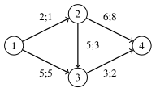
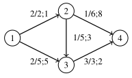
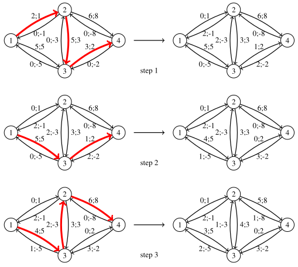

# 6. Graph algorithms

This chapter focuses on advanced graph processing techniques. We start with functional graphs, where each node has exactly one outgoing edge. Next, we discuss how to find Eulerian cycles and explore graph connectedness using depth-first tree based algorithms. Finally, we cover the minimum-cost flow problem, which can be seen as an extended version of the maximum flow problem.

## Background

This chapter assumes that you already know basic graph problems covered in introductory algorithms courses and some standard algorithms for solving them. These problems and algorithms include:

* Depth-first search (DFS) and breadth-first search (BFS)
* Finding shortest paths in weighted graphs (Dijkstra, Bellman–Ford, Floyd–Warshall)
* Topological sorting in directed acyclic graphs
* Finding strongly connected components
* Finding minimum spanning trees (Kruskal, Prim)
* Determining maximum flows (Ford–Fulkerson, Edmonds–Karp)

If you don't know or remember these topics, you should review them first, for example by using the course material of [Data Structures and Algorithms](https://tira.mooc.fi/spring-2026/).

This chapter discusses some more advanced graph processing topics.

## Functional graphs

A directed graph is _functional_ if every node has an outdegree of one. That is, there is exactly one edge starting from each node. For example, here is a functional graph that consists of two components:

A functional graph can be represented as a function $$f$$ that gives the successor for each node. The successor is the node we reach if we follow the only possible edge. For example, in the graph above, $$f(1)=3$$ and $$f(2)=5$$.

Consider a sequence of successors starting at node $$x$$. The first successor is $$f(x)$$, the second successor is $$f(f(x))$$, the third successor is $$f(f(f(x)))$$, and so on. In the example above, the sequence of successors starting at node $$9$$ is

$$9 \rightarrow 1 \rightarrow 3 \rightarrow 7 \rightarrow 1 \rightarrow 3 \rightarrow 7 \rightarrow \dots$$

In this case, there is an infinite cycle that consists of nodes $$1$$, $$3$$, and $$7$$. In fact, every functional graph consists of components where each component has exactly one cycle. If we follow the path from any node, we will eventually reach the cycle of the corresponding component.

Let $$f(x,k)$$ denote the $$k$$th successor of node $$x$$. For example, $$f(x,3)=f(f(f(x)))$$. We can efficiently calculate the value of $$f(x,k)$$ using a technique similar to finding tree ancestors in Chapter 5. First we precalculate all necessary values of $$f(x,2^b)$$, and then we represent any value $$k$$ as the sum of powers of two. For example,

$$f(x,42)=f(f(f(x,2^5),2^3),2^1).$$

Using this technique, we can calculate any value of $$f(x,k)$$ in $$O(\log k)$$ time.

## Eulerian cycles

An Eulerian cycle is a path that starts and ends at the same node and visits each edge exactly once. For example, in the graph

one possible Eulerian cycle is:

We can also represent the cycle above as follows:

$$1 \rightarrow 4 \rightarrow 2 \rightarrow 5 \rightarrow 3 \rightarrow 2 \rightarrow 1.$$

An undirected graph has an Eulerian cycle exactly when all edges belong to a single connected component and the degree of each node is even. For example, in the graph above, nodes $$1$$, $$3$$, $$4$$, and $$5$$ have degree $$2$$, and node $$2$$ has degree $$4$$. This means that all nodes have an even degree.

If the graph has an Eulerian cycle, we can find it using Hierholzer's algorithm. The algorithm constructs the cycle by finding subcycles and adding them to the main cycle. Initially, only node $$1$$ is in the cycle. In each step, we find a node $$x$$ that is already in the cycle and has an edge not yet included in the cycle. Then we start from node $$x$$, find a subcycle that returns to node $$x$$, and add all edges in the subcycle to the main cycle. Since each node has an even degree, we can always find a subcycle by picking arbitrary edges until we return to node $$x$$.

Here is an example of how Hierholzer's algorithm works:

First, we begin at node $$1$$ and create the subcycle $$1 \rightarrow 2 \rightarrow 3 \rightarrow 1$$. After that, we begin at node $$2$$ and create the subcycle $$2 \rightarrow 5 \rightarrow 6 \rightarrow 2$$. Finally, we begin at node $$6$$ and create the subcycle $$6 \rightarrow 3 \rightarrow 4 \rightarrow 7 \rightarrow 6$$. Now the Eulerian cycle is complete because every edge is included in the cycle.

Interestingly, things do not change much with directed graphs. Now, the graph has an Eulerian cycle exactly when all edges belong to a single connected component and the indegree of each node equals the outdegree of that node. That is, each node has the same number of incoming and outgoing edges. We can use Hierholzer's algorithm with directed graphs as well.

We can implement Hierholzer's algorithm in $$O(n+m)$$ time both for undirected and directed graph.

## Graph connectedness

Let us assume we have a connected undirected graph. The graph may contain some edges and nodes that are important for its connectedness:

* A _bridge_ is an edge such that if we remove it from the graph, the graph will no longer be connected.
* An _articulation point_ is a node such that if we remove it (and all its connected edges) from the graph, the graph will no longer be connected.

For example, the following graph has two bridges ($$4-5$$ and $$7-8$$) and three articulation points ($$4$$, $$5$$, and $$7$$):

We can efficiently detect all bridges and articulation points in a graph by performing a depth-first search starting from any node. The search creates a depth-first search tree that classifies the edges of the graph into two types: _tree edges_, which lead to new nodes, and _back edges_, which lead to nodes that have already been visited.

Here is a depth-first search tree for the graph above:

In the tree, tree edges are marked with solid lines and back edges are marked with dashed lines. For example, $$5 \rightarrow 4$$ is a tree edge, and $$7 \rightarrow 5$$ is a back edge.

If an edge in the original graph is a bridge, the corresponding edge in the depth-first search tree is a tree edge $$a \rightarrow b$$ such that the subtree of node $$b$$ does not contain a back edge to node $$a$$ or any of its ancestors.

For example, the edge $$4-5$$ in our example graph is a bridge because the depth-first search tree contains a tree edge $$5 \rightarrow 4$$ and the subtree of node $$4$$ does not have a back edge to node $$5$$ or any of its ancestors.

If a node in the original graph is an articulation point, there are two possible cases:

1. The node is the root of the depth-first search tree and has more than one child.
2. The node has a child, and there is no back edge from the subtree of the child to any ancestor of the node.

For example, node $$5$$ in our example graph is an articulation point because it is the root node of the depth-first search tree and has two children (case 1).

As another example, node $$4$$ is an articulation point because it has a child node $$2$$ whose subtree does not have a back edge to any ancestor of node $$4$$ (case 2).

With proper bookkeeping, we can detect all bridges and articulation points during depth-first search in $$O(n+m)$$ time.

## Minimum-cost flows

Consider a directed graph with two special nodes: a source and a sink. Each edge has a capacity and a cost. The task is to find the minimum-cost flow of $$k$$ units from the source to the sink in the graph.

As an example, consider the following graph:

In this graph, node $$1$$ is the source and node $$4$$ is the sink. The notation $$c;x$$ means that the capacity of the edge is $$c$$ and the cost is $$x$$. For example, there can be at most $$2$$ units of flow from node $$1$$ to node $$2$$, and the unit cost is $$1$$.

Now suppose we want to find a minimum-cost flow of $$k=4$$ units from the source to the sink. We can do this as follows:

Here, each edge shows both the actual flow and the maximum capacity. For example, the edge from node $$1$$ to node $$3$$ has the flow $$2/5$$, which means that the flow is $$2$$ and the capacity is $$5$$.

The total flow from the source to the sink is $$4$$, as required. The total cost of this flow can be calculated as follows:

* From node $$1$$ to node $$2$$: flow $$2$$, cost $$2 \cdot 1 = 2$$
* From node $$1$$ to node $$3$$: flow $$2$$, cost $$2 \cdot 5 = 10$$
* From node $$2$$ to node $$3$$: flow $$1$$, cost $$1 \cdot 3 = 3$$
* From node $$2$$ to node $$4$$: flow $$1$$, cost $$1 \cdot 8 = 8$$
* From node $$3$$ to node $$4$$: flow $$3$$, cost $$3 \cdot 2 = 6$$

Thus, the total cost is $$2+10+3+8+6=29$$, which is the minimum possible.

The minimum-cost flow problem is similar to the better-known maximum flow problem, but there are two differences:

* In the maximum flow problem, each edge only has a capacity. In the minimum-cost flow problem, each edge has both a capacity and a cost.

* In the maximum flow problem, we want to find the maximum flow. In the minimum-cost flow problem, we want to find a flow of $$k$$ units, which may be less than the maximum flow. If $$k$$ is greater than the maximum flow, there is no solution.

The minimum-cost flow problem also resembles the shortest path problem in a weighted graph. In fact, if the capacity of each edge is infinite and $$k=1$$, the resulting flow is the shortest path from the source to the sink.

Interestingly, we can solve the minimum-cost flow problem by combining ideas from maximum flow and shortest path algorithms.

The standard algorithm for solving the maximum flow problem is the Ford–Fulkerson algorithm, which greedily creates augmenting paths from the source to the sink to increase the flow. A good way to implement the algorithm (also called the Edmonds-Karp algorithm) is to use breadth-first search to find augmenting paths with the fewest edges. This ensures the algorithm works in $$O(nm^2)$$ time.

To solve the minimum-cost flow problem, we can use a similar idea. Since edges now have costs, instead of creating augmenting paths with the fewest edges, we create augmenting paths with the minimum total cost. This can be done by using a shortest path algorithm for weighted graphs.

The algorithm works on a graph where each original edge has a reverse edge with initial capacity $$0$$ and cost equal to the negative of the original cost. Each augmenting path increases the flow by $$a$$ units, where $$a$$ is the minimum capacity on the path. After that, we decrease the capacity of each edge on the path by $$a$$ and increase the capacity of each reverse edge by $$a$$. If the last augmenting path would create more than $$k$$ units of flow, we only increase the flow by the amount needed to reach $$k$$ units.

The following figure shows how this works in our example graph, where our goal is to create a flow of $$k=4$$ units from node $$1$$ to node $$4$$:

In step 1, we create a path $$1 \rightarrow 2 \rightarrow 3 \rightarrow 4$$ with minimum capacity $$2$$ and unit cost $$1+3+2=6$$. This path increases the flow by $$2$$ and the cost by $$2 \cdot 6 = 12$$.

In step 2, we create a path $$1 \rightarrow 3 \rightarrow 4$$ with minimum capacity $$1$$ and unit cost $$5+2=7$$. This path increases the flow by $$1$$ and the cost by $$1 \cdot 7 = 7$$.

In step 3, we create a path $$1 \rightarrow 3 \rightarrow 2 \rightarrow 4$$ with minimum capacity $$2$$ and unit cost $$5-3+8=10$$. Since we only need one more unit to reach a total flow of $$4$$ units, the path increases the flow by $$1$$ and the cost by $$1 \cdot 10 = 10$$. After this step, the flow is complete.

The resulting flow is the minimum-cost flow of $$4$$ units from node $$1$$ to node $$4$$ with total cost $$12+7+10=29$$.

Since some edges have negative costs, we need to use a shortest path algorithm that can handle negative edge costs. A standard algorithm for this is the Bellman–Ford algorithm, which runs in $$O(nm)$$ time. Each step of the algorithm increases the flow by at least one unit, so the overall algorithm runs in $$O(nmk)$$ time.

While the idea of using a shortest path algorithm to create augmenting paths makes sense, it is not obvious why the algorithm works correctly. Proving this is difficult and is not discussed in this course.
