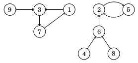
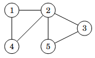
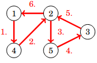
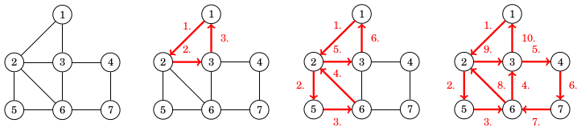
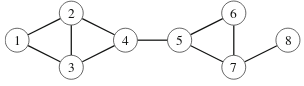
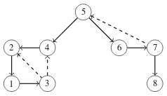

# 6. Graph algorithms

TODO

## Functional graphs

A directed graph is _functional_ if every node has an outdegree of one. That is, there is exactly one edge starting from each node. For example, here is a functional graph that consists of two components:

A functional graph can be represented as a function $$f$$ that gives the successor for each node. The successor is the node we reach if we follow the only possible edge. For example, in the graph above, $$f(1)=3$$ and $$f(2)=5$$.

Consider a sequence of successors starting at node $$x$$. The first successor is $$f(x)$$, the second successor is $$f(f(x))$$, the third successor is $$f(f(f(x)))$$, and so on. In the example above, the sequence of successors starting at node $$9$$ is

$$9 \rightarrow 1 \rightarrow 3 \rightarrow 7 \rightarrow 1 \rightarrow 3 \rightarrow 7 \rightarrow \dots$$

In this case, there is an infinite cycle that consists of nodes $$1$$, $$3$$, and $$7$$. In fact, every functional graph consists of components where each component has exactly one cycle. If we follow the path from any node, we will eventually reach the cycle of the corresponding component.

Let $$f(x,k)$$ denote the $$k$$th successor of node $$x$$. For example, $$f(x,3)=f(f(f(x)))$$. We can efficiently calculate the value of $$f(x,k)$$ using a technique similar to finding tree ancestors in Chapter 5. First we precalculate all necessary values of $$f(x,2^b)$$, and then we represent any value $$k$$ as the sum of powers of two. For example,

$$f(x,42)=f(f(f(x,2^5),2^3),2^1).$$

## Eulerian cycles

An Eulerian cycle is a path that starts and ends at the same node and visits each edge exactly once. For example, in the graph

one possible Eulerian cycle is:

We can also represent the cycle above as follows:

$$1 \rightarrow 4 \rightarrow 2 \rightarrow 5 \rightarrow 3 \rightarrow 2 \rightarrow 1.$$

An undirected graph has an Eulerian cycle exactly when all edges belong to a single connected component and the degree of each node is even. For example, in the graph above, nodes $$1$$, $$3$$, $$4$$, and $$5$$ have degree $$2$$, and node $$2$$ has degree $$4$$. This means that all nodes have an even degree.

If the graph has an Eulerian cycle, we can find it using Hierholzer's algorithm. The algorithm constructs the cycle by finding subcycles and adding them to the main cycle. Initially, only node $$1$$ is in the cycle. In each step, we find a node $$x$$ that is already in the cycle and has an edge not yet included in the cycle. Then we start from node $$x$$, find a subcycle that returns to node $$x$$, and add all edges in the subcycle to the main cycle. Since each node has an even degree, we can always find a subcycle by picking arbitrary edges until we return to node $$x$$.

Here is an example of how Hierholzer's algorithm works:

First, we begin at node $$1$$ and create the subcycle $$1 \rightarrow 2 \rightarrow 3 \rightarrow 1$$. After that, we begin at node $$2$$ and create the subcycle $$2 \rightarrow 5 \rightarrow 6 \rightarrow 2$$. Finally, we begin at node $$6$$ and add the subcycle $$6 \rightarrow 3 \rightarrow 4 \rightarrow 7 \rightarrow 6$$. Now the Eulerian cycle is complete because every edge is included in the cycle.

Interestingly, things do not change much with directed graphs. Now, the graph has an Eulerian cycle exactly when all edges belong to a single connected component and the indegree of each node equals the outdegree of that node. That is, each node has the same number of incoming and outgoing edges. We can use Hierholzer's algorithm with directed graphs as well.

## Graph connectivity

## Minimum-cost max-flows
