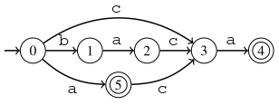

# 7. String processing

This chapter discusses techniques for efficient string processing. We present two approaches for string pattern matching: string hashing and the Z-algorithm. After that, we focus on a more difficult problem where we need to efficiently process several patterns, and discuss a data structure called a suffix automaton for this problem.

## String matching

In this chapter, we focus on a basic string processing problem: the pattern matching problem. In this problem, we are given a string, and our task is to search for a given pattern in the string. For example, the pattern `atti` appears two times in the string `hattivatti` at positions 1 and 6.

We can easily create a brute force algorithm for the problem that uses two nested for loops. For example, the following function `count_patterns` counts the number of times the pattern `pat` appears in the string `str`:

```cpp
int count_patterns(string str, string pat) {
    int n = str.size();
    int m = pat.size();
    int count = 0;
    for (int i = 0; i + m <= n; i++) {
        bool fail = false;
        for (int j = 0; j < m; j++) {
            if (str[i + j] != pat[j]) {
                fail = true;
                break;
            }
        }
        if (!fail) count++;
    }
    return count;
}
```

The function above works in $$O(nm)$$ time, where $$n$$ is the length of the string and $$m$$ is the length of the pattern. This is slow if $$n$$ and $$m$$ are large, and our goal is to create more efficient algorithms.

Note that the algorithm above is already efficient for _random_ strings, because the inner loop will almost always break after a few rounds and the actual running time will be $$O(n)$$. However, we want to create algorithms that are _always_ efficient, for example when both the string and the pattern repeat the same letter.

## String hashing

One efficient approach for string matching is to use _hashing_.  The idea is to compare hash values of strings, which is more efficient than comparing the strings character by character. Using hashing, we can rewrite the brute force string matching algorithm to work more efficiently.

More specifically, we will use _polynomial hashing_, where the hash value of a string is calculated using the following formula:

$$(c[0] A^{n-1}+c[1] A^{n-2}+c[2] A^{n-3}\dots+c[n-1] A^0) \bmod M$$

Here, $$A$$ and $$M$$ are positive integer constants, and $$c[k]$$ is the character code at position $$k$$ in the string.

For example, suppose that $$A=7$$ and $$M=991741297$$. Let's calculate the hash value for the string `atti`. The ASCII codes for the characters are as follows:

character | code
--- | ---
`a` | 97
`t` | 116
`t` | 116
`i` | 105

Using the information above, we can calculate the hash value as follows:

$$(97 \cdot 7^3 + 116 \cdot 7^2 + 116 \cdot 7^1 + 105 \cdot 7^0) \bmod 991741297 = 39872$$

{: .note-title }
Choosing the parameters
<div class="note" markdown="1">
Our hash function is based on two parameters, $$A$$ and $$M$$, which affect how it works. Here are some rules of thumb for choosing the parameters:

* It is good if both parameters are prime numbers.
* $$A$$ can be a relatively small number.
* $$M$$ should be large to provide enough different hash values. At the same time, we should be able to calculate with hash values (for example, when using the `long` data type in C++).

The parameters above are good examples of how the parameters can be chosen.
</div>

The benefit of using polynomial hashing is that after preprocessing a string, we can efficiently calculate the hash value for any of its substring. This can be done by storing the hash value of each prefix of the string, and then using this information when calculating the hash value of a substring.

Here is a useful C++ class that, given a string, provides a function `hash` that efficiently calculates the hash value of any substring:

```cpp
class hasher {
public:
    static const long A = 7;
    static const long M = 991741297;

    std::vector<long> prefix;
    std::vector<long> power;

    hasher(const std::string &s) {
        int n = s.size();
        prefix.assign(n + 1, 0);
        power.assign(n + 1, 1);

        for (int i = 0; i < n; ++i) {
            prefix[i + 1] = (prefix[i] * A + s[i]) % M;
            power[i + 1] = (power[i] * A) % M;
        }
    }

    long hash(int a, int b) {
        return (prefix[b + 1] - (prefix[a] * power[b - a + 1]) % M + M) % M;
    }
};
```

Here, the vector `prefix` stores the hash value for each prefix, and the vector `power` stores values of the form $$A^k \bmod M$$, which are used for calculating the hash value of a substring.

The function `hash` returns the hash value for a substring in $$O(1)$$ time.

For example, we can use the class as follows:

```cpp
auto h = hasher("hattivatti");
cout << h.hash(0, 9) << "\n"; // 753935
cout << h.hash(1, 1) << "\n"; // 97
cout << h.hash(1, 4) << "\n"; // 39872
cout << h.hash(6, 9) << "\n"; // 39872
```

Now we can rewrite the `count_patterns` function as follows:

```cpp
int count_patterns(string str, string pat) {
    int n = str.size();
    int m = pat.size();
    auto str_h = hasher(str);
    auto pat_h = hasher(pat);
    int count = 0;
    for (int i = 0; i + m <= n; i++) {
        if (str_h.hash(i, i + m - 1) == pat_h.hash(0, m - 1)) {
            count++;
        }
    }
    return count;
}
```

The function checks all possible positions where the pattern can appear in the string and compares the hash values of the pattern and the substring. If the hash values are the same, we conclude that a pattern occurrence has been found. The running time of the algorithm is $$O(n+m)$$.

The hashing algorithm is efficient, but there is a catch: it may give an incorrect result. When two strings have different hash values, we are safe because we know for sure that the strings are different. However, when two strings have the same hash value, they are probably the same, but it is possible that two different strings accidentally have the same hash value. The problem is that the algorithm assumes that two strings with the same hash value are the same, but this is not necessarily true.

In practice, string hashing works surprisingly well, but there is always a possibility that it fails. In particular, if an adversary knows the values of $$A$$ and $$M$$, they can easily construct two different strings that have the same hash value. Next, we will look at another approach that also works in $$O(n+m)$$ time but always gives the correct result.

## Z-algorithm

The Z-algorithm efficiently calculates, for each position in a string, the length of the longest substring starting from that position that matches a prefix of the string. The result of the algorithm is called the Z-array.

Here is the Z-array for the string `aaabcaaabaa`:

a | a | a | b | c | a | a | a | b | a | a
-- | 2 | 1 | 0 | 0 | 4 | 2 | 1 | 0 | 2 | 1

For example, the value at position $$1$$ is $$2$$ because `aa` is the longest substring starting from position $$1$$ which is also a prefix of the string. Note that the first position of the Z-array doesn't have a value.

Here is an implementation of the Z-algorithm:

```cpp
vector<int> create_z(const string &s) {
    int n = s.size();
    vector<int> z(n);
    int l = 0, r = 0;
    for (int i = 1; i < n; ++i) {
        if (i <= r) {
            z[i] = min(r - i + 1, z[i - l]);
        }
        while (i + z[i] < n && s[z[i]] == s[i + z[i]]) {
            z[i]++;
        }
        if (i + z[i] - 1 > r) {
            l = i;
            r = i + z[i] - 1;
        }
    }
    return z;
}
```

The algorithm calculates the Z-values from left to right. It maintains a window $$[l,r]$$ that represents a previously calculated substring from position $$l$$ to position $$r$$, which matches a prefix of the string such that $$r$$ is the largest possible.

When calculating the Z-value for position $$i$$, the algorithm checks if $$i$$ is inside the window $$[l,r]$$. If it is, we can use an already computed Z-value as a starting point for calculating the value for position $$i$$. After that, the algorithm extends the current substring character by character, and finally updates the window if necessary.

The Z-algorithm works in $$O(n)$$ time because character-by-character comparison is done only after the current window, and then the window is updated to speed up future calculations.

We can use the Z-algorithm to efficiently count the number of pattern occurrences in a string as follows:

```cpp
int count_patterns(string str, string pat) {
    auto z = create_z(pat + "#" + str);
    int m = pat.size();
    int count = 0;
    for (int i = 0; i < z.size(); i++) {
        if (z[i] == m) {
            count++;
        }
    }
    return count;
}
```

The idea is to create a string that contains the pattern, a special delimiter character (here `#`), and then the string where we want to search for the pattern. After running the Z-algorithm, the positions with the value $$m$$ (the pattern length) correspond to pattern occurrences.

For example, to find the pattern `atti` in the string `hattivatti`, we create the string `atti#hattivatti`. After running the Z-algorithm, we get the following Z-array:

a | t | t | i | # | h | a | t | t | i | v | a | t | t | i
-- | 0 | 0 | 0 | 0 | 0 | 4 | 0 | 0 | 0 | 0 | 4 | 0 | 0 | 0

There are two positions that contain the pattern length $$4$$, which correspond to the two pattern occurrences.

This pattern matching algorithm works in $$O(n+m)$$ time because the length of the string given to the Z-algorithm is $$n+m+1$$. Unlike the hashing algorithm, this algorithms always produces the correct result.

## Suffix automaton

Using string hashing or the Z-algorithm, we can efficiently find pattern occurrences in a string when given a single pattern. In a more difficult setting, our task is to preprocess a string so that we can efficiently answer pattern queries. Some possible queries are:

* Does the pattern appear in the string?
* How many times does the pattern appear in the string?
* What is the first or last position where the pattern appears?

Next, we show how to efficiently process queries like these by creating a data structure called a suffix automaton. A suffix automaton is a minimal deterministic finite automaton that accepts all strings that are suffixes of the original string. For example, the following automaton for the string `baca` accepts its suffixes `a`, `ca`, `aca`, and `baca`.



In the above automaton, state $$0$$ is the starting state, and states $$4$$ and $$5$$ are accepting states. Each path from the starting state to an accepting state corresponds to a suffix of the string. For example, the path $$0 \rightarrow 3 \rightarrow 4$$ corresponds to the suffix `ca`.

Since the automaton is minimal, there are no extra states. This means that if we are in any state, we can always extend the path from the current state to some accepting state. Thus, for each substring of the string, there is a path in the automaton from the starting state to some state.

Surprisingly, we can build a suffix automaton for a given string in $$O(n)$$ time, where $$n$$ is the length of the string. Here is a black box C++ class for the task:

```cpp
class SuffixAutomaton {
public:
    struct State {
        int len, link;
        std::map<char, int> next;
        bool accept;
        State(int len, int link) : len(len), link(link) {}
    };

    std::vector<State> states;
    int last;

    SuffixAutomaton(const std::string& s) {
        states.reserve(2 * s.size());
        states.emplace_back(0, -1);
        last = 0;
        for (char c : s) add(c);
        for (int s = last; s != 0; s = states[s].link) {
            states[s].accept = true;
        }
    }

private:
    void add(char c) {
        int cur = states.size();
        states.emplace_back(states[last].len + 1, 0);
        int p = last;
        while (p != -1 && !states[p].next.count(c)) {
            states[p].next[c] = cur;
            p = states[p].link;
        }
        if (p == -1) {
            states[cur].link = 0;
        } else {
            int q = states[p].next[c];
            if (states[p].len + 1 == states[q].len) {
                states[cur].link = q;
            } else {
                int clone = states.size();
                states.emplace_back(states[p].len + 1, states[q].link);
                states[clone].next = states[q].next;
                while (p != -1 && states[p].next[c] == q) {
                    states[p].next[c] = clone;
                    p = states[p].link;
                }
                states[q].link = states[cur].link = clone;
            }
        }
        last = cur;
    }
};
```

In each state, the map `next` contains all edges that start from that state, and the field `accept` indicates if the state is an accepting state. The fields `len` and `link` provide additional information about the state, which is not discussed here.

As an example, the following code builds a suffix automaton for the string `baca` and shows the states and edges in the automaton:

```cpp
auto sa = SuffixAutomaton("baca");
std::cout << "number of states: " << sa.states.size() << "\n";
for (int i = 0; i < sa.states.size(); i++) {
    std::cout << "state " << i << " " << sa.states[i].accept << "\n";
    for (auto edge : sa.states[i].next) {
        std::cout << "  edge " << edge.first << " " << edge.second << "\n";
    }
}
```

The output of the code is as follows:

```
number of states: 6
state 0 0
  edge a 5
  edge b 1
  edge c 3
state 1 0
  edge a 2
state 2 0
  edge c 3
state 3 0
  edge a 4
state 4 1
state 5 1
  edge c 3
```

Let's see how we can solve some pattern matching problems after constructing a suffix automaton for a string. First, a pattern appears in the string exactly when we reach some state when we begin at the starting state and process all pattern characters from left to right. For example, the pattern `ac` appears in the string `baca` because we reach state $$3$$ in our example automaton. This state is not an accepting state, so `ac` is not a suffix, but it is a prefix of a suffix, which means that it appears in the string.

To count the number of times a pattern appears in the string, we can first find the state that corresponds to the pattern and then count the number of paths from that state to any accepting state. For example, the pattern `a` appears in the string `baca` two times, because there are two paths from state $$5$$ to an accepting state: the first path is empty (since state $$5$$ is an accepting state) and the second path is $$5 \rightarrow 3 \rightarrow 4$$.

Similarly, to find the first and last occurrences of the pattern, we can first find the state that corresponds to the pattern and then calculate the lengths of the shortest and longest paths from the state to an accepting state. The shortest path corresponds to the last pattern occurrence, and the longest path corresponds to the first occurrence. In our example, the shortest path is the empty path with length $$0$$, so the position of the last occurrence is $$3-0=3$$. The longest path is the path $$5 \rightarrow 3 \rightarrow 4$$ with length $$2$$, so the position of the first occurrence is $$3-2=1$$.

Since a suffix automaton is a directed acyclic graph, we can use dynamic programming to efficiently calculate the number of paths and the lengths of the shortest and longest paths.
