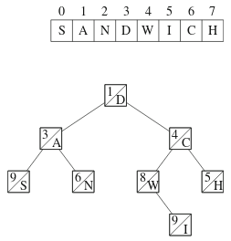
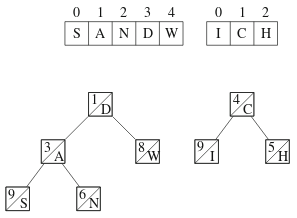
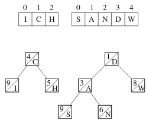
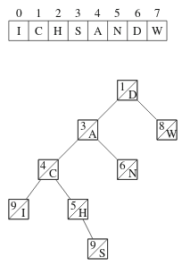

# 8. Advanced queries

In this chapter, we discuss the treap data structure, which can be used to support more advanced queries. A treap is a randomized balanced binary tree that is easy to implement. A basic feature of treaps is that they provide efficient split and merge operations on sequences.

## Treap structure

Let's start with an example where our sequence is the string SANDWICH. The following figure shows the sequence and a corresponding treap:



Each treap node contains a weight and a value. Here we assume that each weight is a random integer, and each value corresponds to a character in the string. For example, in the treap above, the root node has weight 1 and its value is `D`.

We can think of the contents of a treap like this: in each node, all nodes in the left subtree come before the node in the sequence, and all nodes in the right subtree come after the node in the sequence. In the treap above, the left subtree of the root node contains three nodes and the right subtree of the root contains four nodes. This tells us that the length of the sequence is $$8$$ and the root node has index $$3$$.

Given a sequence as a treap, an inorder traversal of the tree can be used to construct the sequence. In an inorder traversal, for each node we first process its left subtree, then add the value of the node to the sequence, and finally process its right subtree.

The weights are used to balance the treap. The weights are used to balance the treap. It is required that the weight of every node be greater than or equal to the weight of its parent. For example, in the treap above, the weight of the root node is $$1$$ and the weight of its children are $$3$$ and $$4$$. The weights are random integers, and their only purpose is to keep the tree balanced during treap operations.

## Treap operations

The basic operations in treaps are _split_ and _merge_. Let's first split our example treap into two treaps. This corresponds to splitting the sequence into a left and a right part.

We can freely choose the position where we split the treap. For example, we can split the treap as follows:



The result is that we have two treaps: the first treap corresponds to the string SANDW and the second treap corresponds to the string ICH. Note that in both treaps, all the weights are in the correct order.

Now, let's swap the treaps as follows:



After this, we can merge the treaps and create a single treap that contains all the characters. Since we swapped the treaps, the resulting string will be ICHSANDW:



The efficiency of a treap is based on the fact that each node has a random weight. Because of this, when splitting and merging are done according to the weights, the operations take $$O(\log ⁡n)$$ time.

## Treap implementation

The following code includes a concise treap implementation that provides the operations `split` and `merge`. The code also shows how we can create the string SANDWICH, split it into two strings, and merge the swapped strings to create the string ICHSANDW.

```cpp
struct node {
    node *left, *right;
    int weight, size, value;
    node (int v) {
        left = right = NULL;
        weight = rand();
        size = 1;
        value = v;
    }
};

int size(node *treap) {
    if (treap == NULL) return 0;
    return treap->size;
}

void split(node *treap, node *&left, node *&right, int k) {
    if (treap == NULL) {
        left = right = NULL;
    } else {
        if (size(treap->left) < k) {
            split(treap->right, treap->right, right, k - size(treap->left) - 1);
            left = treap;
        } else {
            split(treap->left, left, treap->left, k);
            right = treap;
        }
        treap->size = size(treap->left) + size(treap->right) + 1;
    }
}

void merge(node *&treap, node *left, node *right) {
    if (left == NULL) treap = right;
    else if (right == NULL) treap = left;
    else {
        if (left->weight < right->weight) {
            merge(left->right, left->right, right);
            treap = left;
        } else {
            merge(right->left, left, right->left);
            treap = right;
        }
        treap->size = size(treap->left) + size(treap->right) + 1;
    }
}

void print(node *treap) {
    if (treap == NULL) return;
    print(treap->left);
    cout << (char)treap->value;
    print(treap->right);
}

int main() {
    // create a treap for the string SANDWICH
    node *treap = NULL;
    merge(treap, treap, new node('S'));
    merge(treap, treap, new node('A'));
    merge(treap, treap, new node('N'));
    merge(treap, treap, new node('D'));
    merge(treap, treap, new node('W'));
    merge(treap, treap, new node('I'));
    merge(treap, treap, new node('C'));
    merge(treap, treap, new node('H'));

    // print the string SANDWICH
    print(treap);
    cout << "\n";

    // split the string into SANDW and ICH
    node *left, *right;
    split(treap, left, right, 5); // 5 = size of the left part

    // swap the parts and create the string ICHSANDW
    merge(treap, right, left);

    // print the string ICHSANDW
    print(treap);
    cout << "\n";
}
```

As shown above, we can construct the string using the function `merge` by adding the characters of the string one by one from left to right. After that, we use the functions `split` and `merge` to modify the string. In addition, we use the `print` function to print the contents of the string.

## More features
